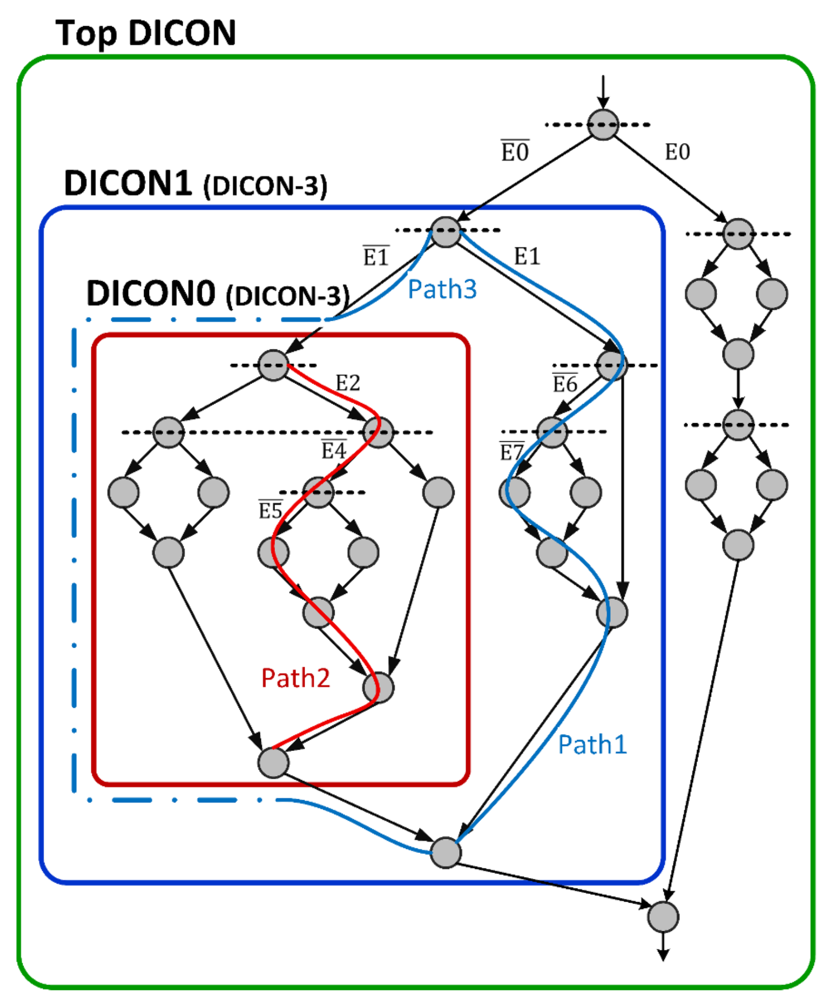
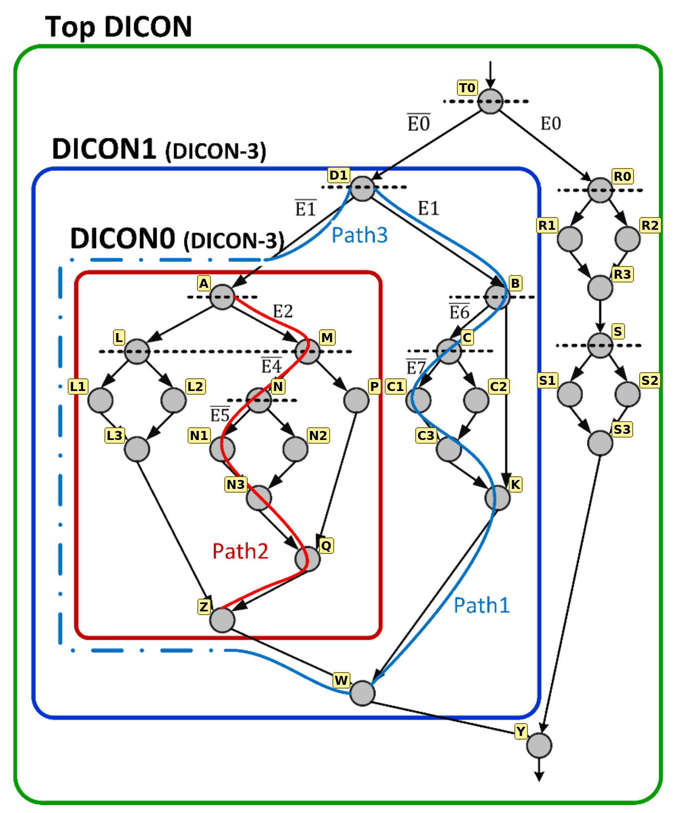

# FIND_DICON — DICON Structural Discovery in C

This repository is a C implementation of **Algorithm 1 (FIND_DICON)** from the paper
*"CFI Checking by Collaboration of Processor-Compiler and its RTL Implementation"*.
The program takes a control-flow graph (CFG) and finds its **DICONs** (Divergence–Convergence blocks).
For each DICON it reports the **begin** node and the **end** node. The compiler uses these two nodes to insert the `Begin_DICON` / `End_DICON` instructions.

The code is tested on the example graph from **Fig. 3(b)** of the paper. It finds the same three DICONs that the figure shows.

---

## 1. The test graph

This is the original figure from the paper:



The figure has no node names, so a name was given to every node. This is the same graph with the names used in the code:



| Name | Role in the figure |
|---|---|
| `T0` | Entry node, first branch (E0) |
| `D1` | First node of **DICON1** (branch E1) |
| `A` | First node of **DICON0** (branch E2) |
| `L`, `L1`, `L2`, `L3` | Left if/else inside DICON0 |
| `M` | Node after E2 (branch E4) |
| `N`, `N1`, `N2`, `N3` | Inner if/else (branch E5) |
| `P` | Right child of `M` |
| `Q` | Convergence point of `M` |
| `Z` | Last node of **DICON0** |
| `B` | Node after E1 (branch E6) |
| `C`, `C1`, `C2`, `C3` | Inner if/else (branch E7) |
| `K` | Convergence point of `B` (the E6 edge goes directly `B → K`) |
| `W` | Last node of **DICON1** |
| `R0`–`R3`, `S`–`S3` | Two if/else blocks on the E0 side |
| `Y` | Final node, last node of the **Top DICON** |

---

## 2. How to build and run

Requirements: a C99 compiler, for example `gcc` or `clang`.

```bash
gcc -std=c99 -Wall -Wextra -O2 find_dicon.c -o find_dicon
./find_dicon
```

The program builds the Fig. 3(b) graph, runs the algorithm on it, and prints the result.

---

## 3. How the program works

The program runs in three steps. The function `detect_dicons()` calls them in this order.

### Step 1 — Remove loops: `remove_back_edges()`

The algorithm needs a graph with no loops (a DAG).
A DFS goes through the graph. Any edge that points back to a node that is still on the DFS stack is a loop edge, and it is removed.
Fig. 3(b) has no loops, so nothing changes here.

### Step 2 — Find the convergence points: `compute_end_points()`

For every divergence node `u`, the algorithm needs **`u.end`**. This is the nearest node where the two branches of `u` meet again.
In graph terms, `u.end` is the **immediate post-dominator** of `u`: the first node that *every* path from `u` must pass through.
The program computes it with an iterative bit-set analysis. A virtual exit node is placed after all leaf nodes.

The results for Fig. 3(b):

| Node | `end` | | Node | `end` |
|---|---|---|---|---|
| `T0` | `Y` | | `B` | `K` |
| `D1` | `W` | | `C` | `C3` |
| `A` | `Z` | | `R0` | `R3` |
| `L` | `L3` | | `S` | `S3` |
| `M` | `Q` | | | |
| `N` | `N3` | | | |

### Step 3 — Find the DICONs: `find_dicon(u, f)`

This is Algorithm 1. It visits the graph recursively. `f` is the **finish node**: the walk stops when it reaches `f`.

Each node stores two values:

- **`local_depth`**: the number of branch levels below the node that are still "open" (not yet recorded as a DICON). A depth of *n* means up to 2ⁿ paths, so the path ID needs *n* bits.
- **`local_end`**: the node where the structure that starts here ends.

The node type decides what happens:

1. **Leaf, or `u == f`.** Depth is 0 and `local_end = u`.
2. **One successor (linear node).** The node copies the depth and end of its successor. A plain block adds no branching.
3. **Two successors (divergence node).**
   1. Visit both branches, stopping at `u.end`. Then `depth = max(depth of the two branches) + 1`.
   2. **Nullifying.** If `3 ≤ depth ≤ 6`, record `[u, u.end]` as a DICON and set `depth = 0`.
      After this, the whole DICON counts as one simple node for the levels above it.
   3. **Merge.** Visit the part after the convergence point (`m = u.end`), up to `f`. Add its depth to `u`'s depth.
      - If the sum is between 3 and 6, record the upper and lower parts together as one DICON `[u, m.local_end]`, and set `depth = 0`.
      - If the sum is 7 (too large to merge), record only the lower DICON. The upper part stays open, and the parent level can absorb it.

The recorded DICONs are stored in the global array `blocks`.

---

## 4. What happens on Fig. 3(b)

The call `find_dicon(T0, NONE)` starts the run. The DICONs are recorded **from the inside out**: the innermost block is completed first.

### ① DICON0 is found at node `A`

`A` is visited with `f = W`, because `W` is `D1.end`.

| Node | Calculation | Depth |
|---|---|---|
| `L` | its two branches are simple → `max(0,0)+1`; the part after it (`L3 → Z`) adds 0 | **1** |
| `N` | `max(0,0)+1` (branch E5) | **1** |
| `P` | linear, goes straight to `Q` | **0** |
| `M` | `max(N=1, P=0)+1` (branch E4) | **2** |
| `A` | `max(L=1, M=2)+1` (branch E2) | **3** |

Since `3 ≤ 3 ≤ 6`:

- `[A, Z]` is recorded as **DICON0**.
- `A`'s depth is reset to **0** (nullifying).

The merge step then looks at `Z → W`, which adds 0. So `A` returns depth 0.

In the figure, this corresponds to the dash-dotted blue line: for the levels above, DICON0 now behaves like a single edge.

### ② DICON1 is found at node `D1`

`D1` is visited with `f = Y`.

| Node | Calculation | Depth |
|---|---|---|
| `A` | already nullified in ① | **0** |
| `C` | `max(0,0)+1` (branch E7) | **1** |
| `B` | `max(C=1, K=0)+1` (branch E6; its right edge goes straight to `K`) | **2** |
| `D1` | `max(A=0, B=2)+1` (branch E1) | **3** |

- `[D1, W]` is recorded as **DICON1**.
- `D1`'s depth is reset to **0**.

This is why **Path3** in the figure records only the E̅1 edge and then goes *around* DICON0. The paths inside DICON0 are checked separately by DICON0's own ID (for example **Path2**: E2, E̅4, E̅5).

### ③ The E0 side is merged and not recorded

`R0` is visited with `f = Y`.

| Node | Calculation | Depth |
|---|---|---|
| `R0` (own branch only) | `max(0,0)+1` | 1 |
| `S` | `max(0,0)+1` | 1 |
| lower part `R3 → S → … → Y` | depth of `S` | 1 |
| `R0` after merge | `1 + 1` | **2** |

The merged depth is 2, which is below 3. So no DICON is recorded here. The two if/else blocks stay open, and the parent level (`T0`) absorbs them. The figure agrees: this side has no box of its own.

### ④ The Top DICON is found at node `T0`

| Node | Calculation | Depth |
|---|---|---|
| `T0` | `max(D1=0, R0=2)+1` (branch E0) | **3** |

- `[T0, Y]` is recorded as the **Top DICON**.
- The part after `Y` adds nothing, because `Y` is the last node.

### Recursion order (summary)

```
find_dicon(T0, -)
├── find_dicon(D1, Y)
│   ├── find_dicon(A, W)
│   │   ├── find_dicon(L, Z)          depth 1
│   │   ├── find_dicon(M, Z)          depth 2
│   │   │   ├── find_dicon(N, Q)      depth 1
│   │   │   └── find_dicon(P, Q)      depth 0
│   │   └── depth 3  →  record DICON0 = [A, Z], reset to 0
│   ├── find_dicon(B, W)              depth 2
│   │   ├── find_dicon(C, K)          depth 1
│   │   └── find_dicon(K, K)          stop (u == f)
│   └── depth 3  →  record DICON1 = [D1, W], reset to 0
├── find_dicon(R0, Y)                 depth 1 + merge 1 = 2  (not recorded)
└── depth 3  →  record Top DICON = [T0, Y]
```

---

## 5. Program output

```
=== Fig. 3(b) ===
node   end    local_depth  local_end
T0     Y      0            Y
D1     W      0            Y
A      Z      0            W
L      L3     1            Z
L1     L3     0            L3
L2     L3     0            L3
L3     Z      0            Z
M      Q      2            Z
N      N3     1            Q
N1     N3     0            N3
N2     N3     0            N3
N3     Q      0            Q
P      Q      0            Q
Q      Z      0            Z
Z      W      0            W
B      K      2            W
C      C3     1            K
C1     C3     0            C3
C2     C3     0            C3
C3     K      0            K
K      W      0            W
W      Y      0            Y
R0     R3     2            Y
R1     R3     0            R3
R2     R3     0            R3
R3     S      1            Y
S      S3     1            Y
S1     S3     0            S3
S2     S3     0            S3
S3     Y      0            Y
Y      -      0            Y

Detected DICONs:
  DICON0: begin = A, end = Z
  DICON1: begin = D1, end = W
  DICON2: begin = T0, end = Y
```

How to read the table:

- `A`, `D1` and `T0` have `local_depth = 0` because they were nullified after being recorded.
- `M`, `B` and `R0` show depth 2. This is the value their parent used in its calculation.
- `local_end` of `A` and `D1` goes past their own DICON end (to `W` and `Y`). This comes from the merge step, which also walks the part after the convergence point.
- The `end` column of a linear node (for example `W → Y`) is its post-dominator. The algorithm does not use it.

**Result:** the three detected DICONs (`DICON0 = [A, Z]`, `DICON1 = [D1, W]`, `DICON2 = [T0, Y]`) are the red, blue and green boxes of the figure. Both inner ones are DICON‑3, as the figure labels say.

---

## 6. Differences from the pseudocode

The C code follows the pseudocode, with three corrections:

1. **Case 1 also stops when `u == f`.** This matches the paper's text. Without this check, a branch walk would not stop at `u.end` and would continue to the end of the program.
2. **Line 39 records `{m, m.local_end}`.** The pseudocode uses `m.local_start`, but that value is never defined.
3. **Top-DICON rule.** If the entry node still has depth > 0 when the run ends, `detect_dicons()` records the remaining region as the Top DICON. In Fig. 3(b) this rule is not needed, because `T0` reaches depth 3 and is recorded in the normal way.

One point is left for review. With the current thresholds (nullify at 3–6), every call returns depth ≤ 2. This means the combined depth can never reach 7, so the "isolate subsequent DICON" branch (`depth == 7`) never runs. If DICONs up to depth 6 are wanted, the two thresholds in `find_dicon()` (`MIN_DICON_DEPTH`, `MAX_DICON_DEPTH` and the `== MAX_DICON_DEPTH + 1` check) should be reviewed.

---

## 7. Testing your own graph

1. Give each node a name in an `enum`, and write the matching strings in a `names[]` array.
2. Call `cfg_init(&g, N)` and add the edges with `add_edge(&g, from, to)`. A node can have at most 2 successors.
3. Call `detect_dicons(&g, entry)` and then `print_result(&g, names)`.

Current limits:

- A node can have at most two successors (conditional branches). Indirect jumps with many targets are not modelled.
- The graph size is limited by `MAX_NODES` (128).

---

## Files

```
find_dicon.c              implementation + Fig. 3(b) test
README.md                 this file
images/fig3b.png          original figure from the paper
images/fig3b_labeled.png  same figure with the node names used in the code
```
